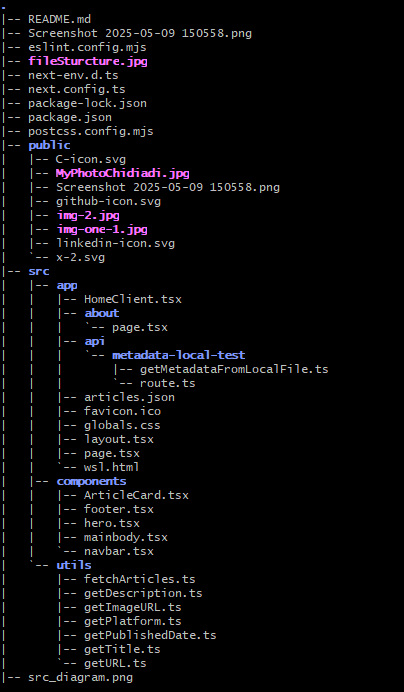

# Simple Writer Portfolio Blog

This repository contains the code for the article written about building a simple writer portfolio with Next.js. The project serves as both an example for the article, and the codebase for my technical writing portfolio website.

## Basic Concept Behind It

Because I have written articles on different platforms including LinkedIn, my substack, The Network Bits, and  freeCodeCamp, I wanted a place to put all of it together in a serachable manner. I also didn't want to start editing the project in the future when I write more articles, so I decided to use a JSON file with just the URL of the articles from which other information would be extracted to populate the blog. It turns out I cannot access the cover image URL for LinkedIn posts, probably except I'm logged in. But it still worked fine.

## Challenges Faced

1. I couldn't fetch directly from my components because of CORS, so I had to create an API that I used to fetch the websites from the URL's.

2. I also faced a state management problem, because when I initially imagined the website, I put the search bar inside the MainBody component where the articles would be, but when I started building, I saw that it worked better in the Hero component. It looked better there. So, I put it there. But then I had to implement filtering by search, and found that the form in the Hero element would have to set a state in the MainBody component. I solved that by putting the useState hook in the home page and then passing the state value and updater as props to the respective components. 

3. When testing the extraction of necessary information from the query response, I found out that not all platforms had all the Open Graph metadata I wanted. So, I resorted to using a more hybrid approach of checking both Open Graph metadata and JSON-LD data in the HTML file.

4. The article grid loaded very slowly, as it started fetching data from the URLs just as the MainBody component mounted. Imagine I had 100 articles to load and I had to wait for the process to finish. What I did was to refactor the code, so that the articles are fetched at build time instead of upon user request. Then, they are revalidated every onw hour. That way, the users can have a better and faster experience.

## Project Structure

Here is what the project file structure looks like:

In the root folder, we have the `public` and `src` folders. All the images and icons used in the project are in the public folder. The `src` folder has the `app`, `components`, and `utils` folders. The `app` folder is the main folder where the first `page.tsx` and `layout.tsx` folders are located. It also has the JSON file for the articles, and the `api` folder which houses the Route Handlers. Initially necessary, but no longer necessary as I've restructured the project.

The `components` folder holds the components, and the `utils` folder holds the functions for extracting various information from the object gotten from a HTTP response. This helps to determine article title, date published, description, cover image and others, from just the URL. Those are then used to build an array of Article objects.

More details about the project are written in the [article](https://freecodecamp.org/news/how-to-build-a-simple-portfolio-blog-with-nextjs).

## Modifications not in the article

After deploying the project, I found that the server was not able to succesfully fetch from Substack. It is being blocked for some reason. So, I decided on another approach. I would use RSS feeds, and extract the necessary information from the feeds to make up the Substack cards.

